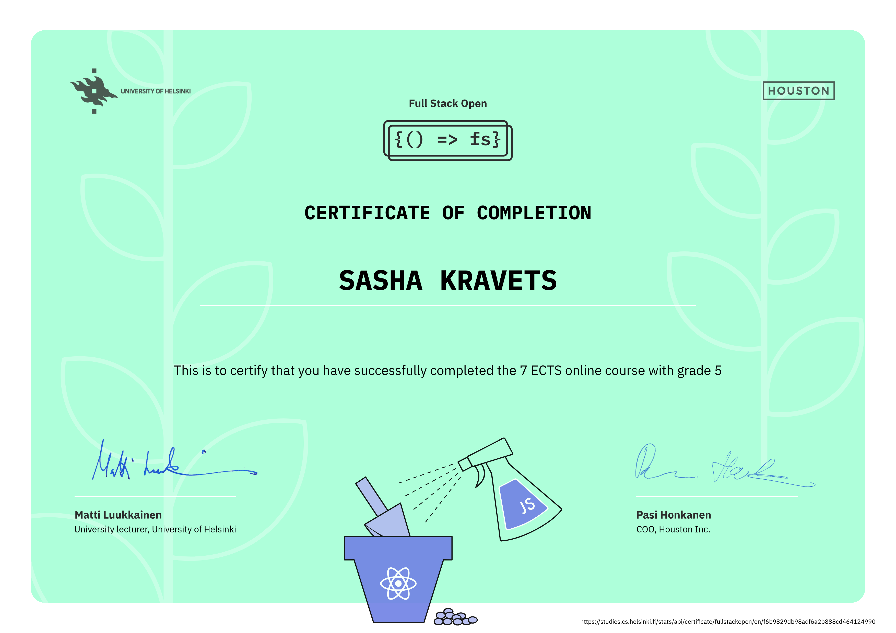

# 📚 Fullstack Open Course

I have successfully completed parts 1–7 of the **Fullstack Open** course provided by the University of Helsinki.

## ✅ Completed Parts
- Part 0: Fundamentals of Web apps
- Part 1: Introduction to React
- Part 2: Communicating with server
- Part 3: Programming a server with NodeJS and Express
- Part 4: Testing Express servers, user administration
- Part 5: Testing React apps, React Router
- Part 6: Advanced state management (State management with Redux)
- Part 7: Custom hooks, esbuild

## 🎓 Certificate

You can view my certificate here:

👉 https://studies.cs.helsinki.fi/stats/api/certificate/fullstackopen/en/f6b9829db98adf6a2b888cd464124990

## 🖼️ Certificate Preview

